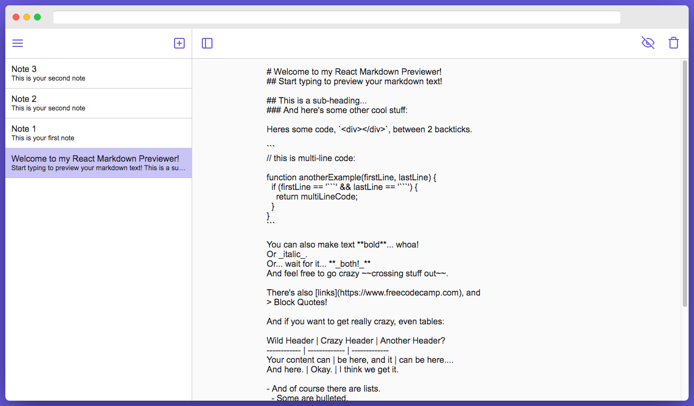
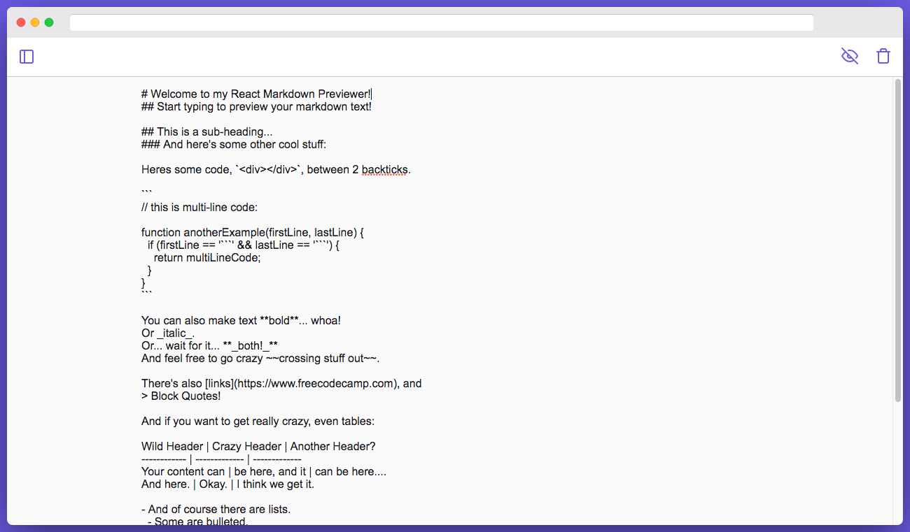
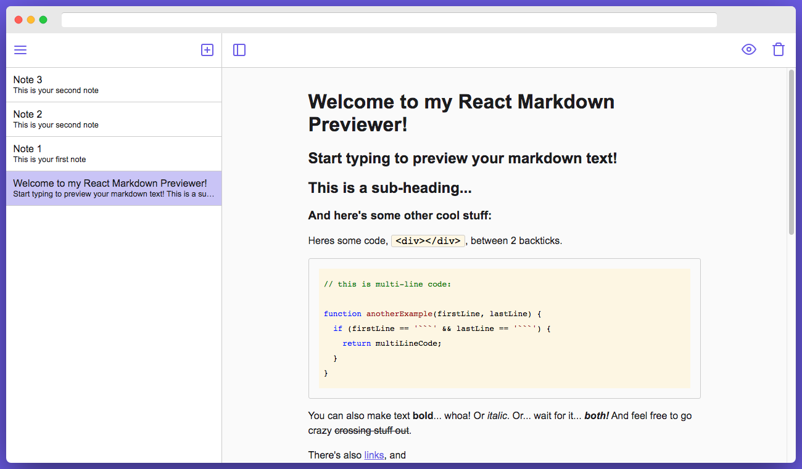
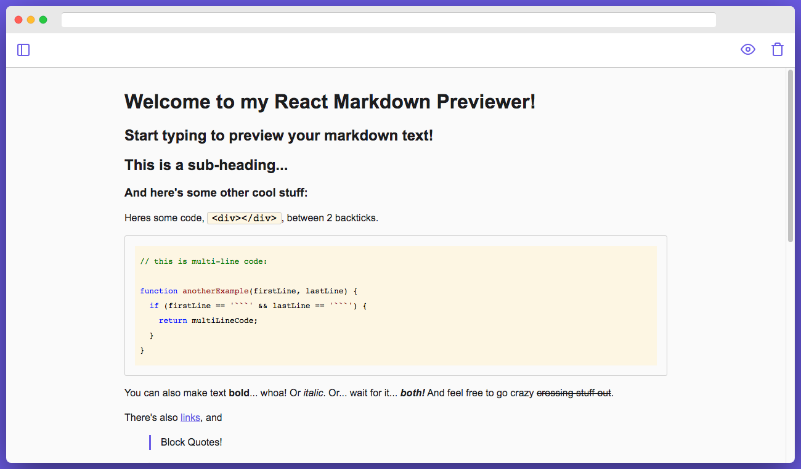
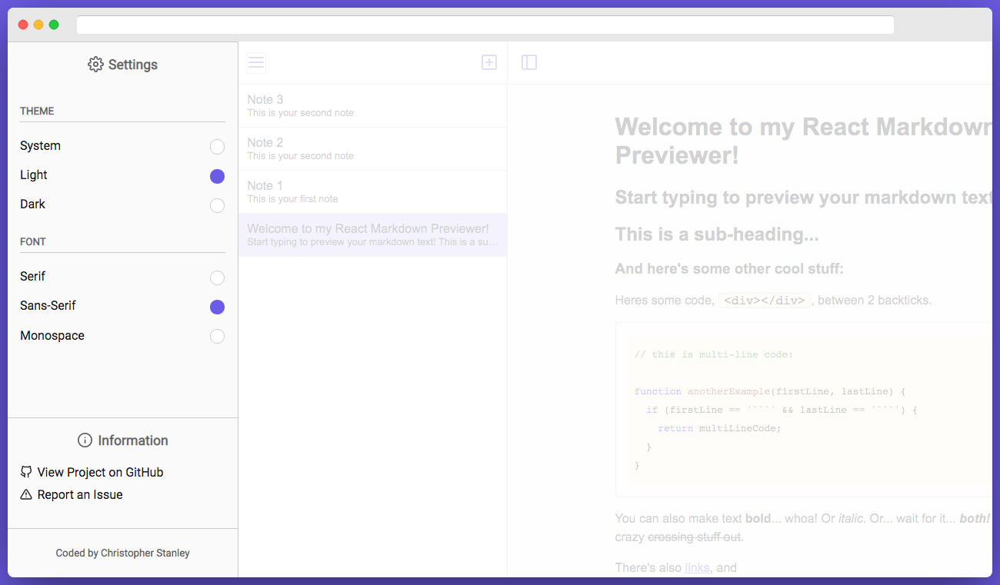

<h1 align="center">EasyNote</h1>

A note-taking app that allows users to view notes in markdown

    
    

## Table of Contents
* [Screenshots](#screenshots)
* [Technologies](#technologies)
* [Features](#features)
* [Inspirations](#inspirations)
* [Contact](#contact)
* [License](#license)

## Screenshots

## Technologies
Built with:
* React.js (version 16.7.0)
* Marked.js (version 0.6.0)
* Highlight.js (version 9.18.1)
* HTML & CSS

Deployed by Netlify

## Features
Complete:
- [X] User can create, edit, and delete notes
- [X] User can toggle the preview to view a note in markdown
- [X] User can toggle the sidebar and menu
- [X] User can select their preferred theme and font in the menu
- [X] Notes and settings are persisted in localStorage

To-Do List:
- [ ] Recently deleted notes are stored in trash
- [ ] Recently deleted notes can be restored

## Inspirations
This project was initially built as part of freeCodeCamp's [Front End Libraries Certification](https://learn.freecodecamp.org/front-end-libraries/front-end-libraries-projects/build-a-markdown-previewer)

Design inspired by [Simplenote](https://simplenote.com/)

## Contact
| Christopher Stanley <small><em>Front-End Developer</em></small> |
|:---:|
|  |
|
&nbsp;&nbsp;
|

## License

This project is licensed under the MIT License- see the [LICENSE](LICENSE) file for details