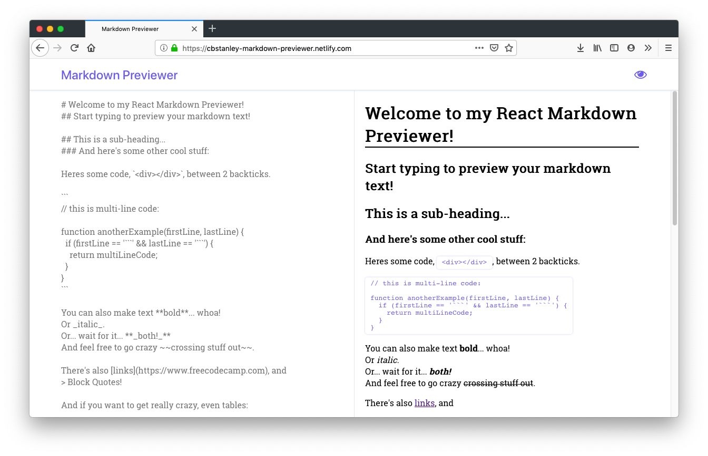
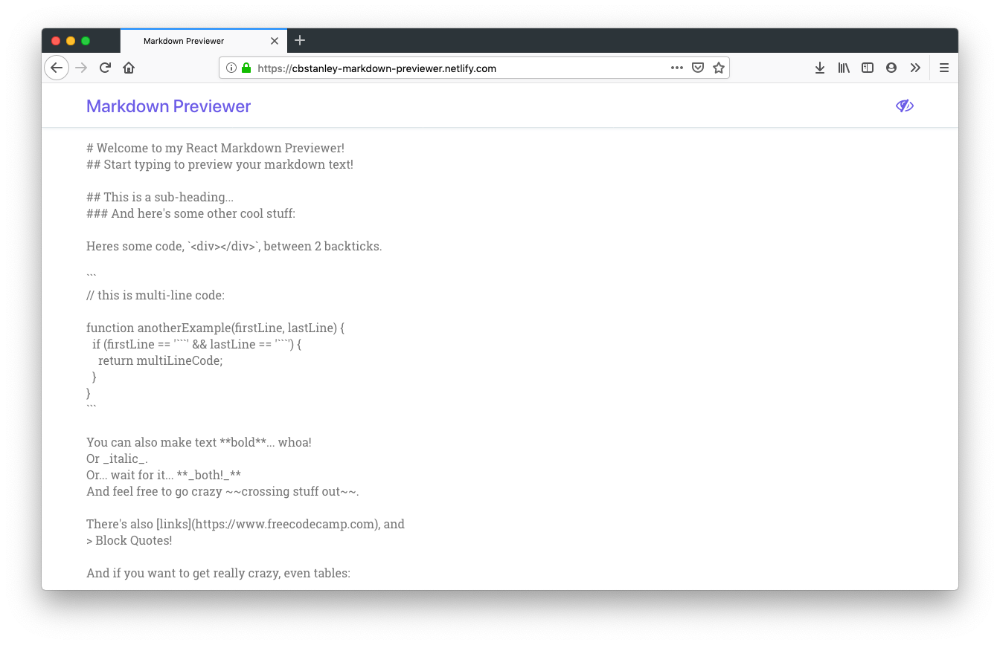

<h1 align="center">Markdown Previewer</h1>

An editor that allows you to preview text as GitHub Flavored Markdown

## Table of Contents
* [Project Status](#project-status)
* [Technologies](#technologies)
* [Features](#features)
* [Screenshots](#screenshots)
* [Inspirations](#inspirations)
* [Contact](#contact)
* [License](#license)

## Project Status
This project is currently: _Complete_

## Technologies
Built with:
* React (create-react-app)
* CSS
* Marked.js

## Features
Complete:
- [X] Preview text as GitHub Flavored Markdown

## Screenshots

## Inspirations
This project was built as part of freeCodeCamp's [Front End Libraries Certification](https://learn.freecodecamp.org/front-end-libraries/front-end-libraries-projects/build-a-markdown-previewer)

## Contact
Twitter - [@CBStanley12](https://twitter.com/CBStanley12)

DEV - [cbstanley12](https://dev.to/cbstanley12)

Portfolio - [cbstanley.tech](https://cbstanley.tech)

## License
**MIT License**: 
A short and simple permissive license with conditions only requiring preservation of copyright and license notices. Licensed works, modifications, and larger works may be distributed under different terms and without source code.